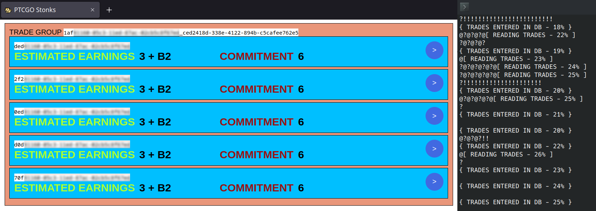
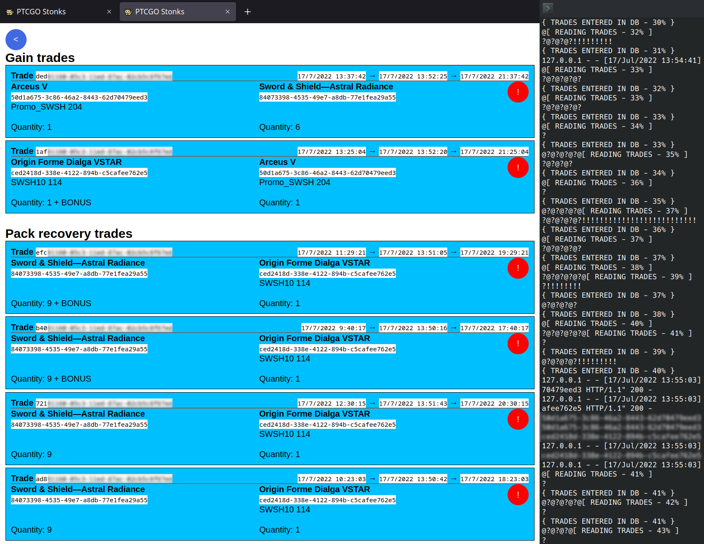
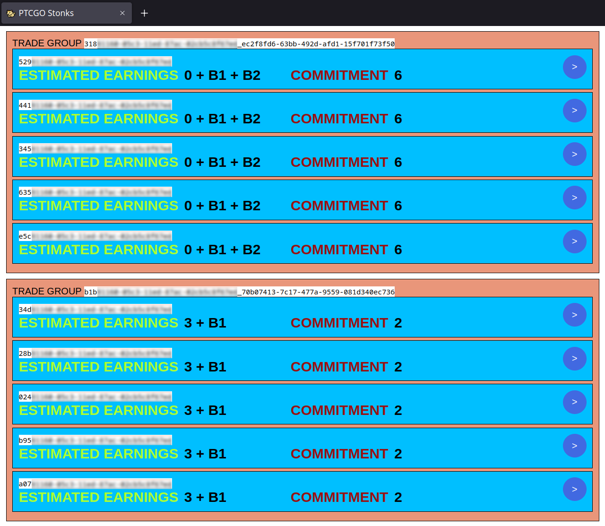

# PTCGO Stonks

Alternative client for the trade section of Pokemon Trading Card Game Online with profitable trade detector and acceptor


## Premises

Since the project contained in this repo is no longer truly usable, I prefer to use this space to tell its story (imagine this readme as something like a blogpost).

Now that PTCGO has closed (June 5, 2023) and everybody switched to Pokemon Live I can share all this with you without worrying about damaging someone or that someone misuses what is contained in this repo.

I would like to specify that all the content of the repo is and was for study purposes only and that it can no longer be used in any useful way.

## Introduction

Have you ever wondered how sites like ptcgoprices.com could provide PTCGO card values ​almost ​in real time? here it is explained!

PTCGO was a game developed by Dire Wolf Digital for The Pokémon Company with the aim of replicating the IRL experience of the pokemon card game by playing it online

The game allowed you to collect pokemon-themed cards and products in two modes: *NON-tradable* and *tradable*

- The *NON-tradable* products were those usually obtained by playing for free, as the name implies they could only be used within your own account
- The *tradable* products were those obtained by redeeming the codes contained in the actual IRL packs or won in in-game tournaments

The economy of the game was based on trading in the *tradable* virtual packs (kept closed) of the latest available expansion

A specific card was worth X unopened packs of the last game card set, and the value was determined by the intersection of supply and demand (like lots of things in real life), this economy was naturally generated by the community and not imposed by the game itself

The game trading interface was very slow and made it very complicated to monitor multiple trade proposals at the same time, this contributed to making many players unaware of the true value of the items being traded, simplifying the work of the speculators

This had also created a secondary market on various ad sites and social networks of users who were selling large quantities of packs for real money (The Pokémon Company solved this "problem" in  Pokémon Live by removing trading and by limiting the quantity of redeemable packs per set per user)

Over time, several sites were born such as ptcgoprices (which I think was the most famous), which analyzed all the trades available in the game and indicated the trend in the value of the cards and products in the game over time, information that the game never made officially available.
Various sites were also born that sold the codes contained in the IRL packs, but that's another story.

Once a developer was able to find this information within the game files, it was immediately clear to him how simple it was not only to collect information on the value of the items traded, but also to automatically identify sequences of trades which lead to almost zero-effort gain automatically

If you are also interested in the more technical details see the following sections, otherwise I think you can skip to the screenshots

## Screenshots with descriptions



In this screenshot, the orange block represents a trading pair that leads to having a card with a higher value than the number of packs spent:

- The id written in the orange block represents `ID-SECOND-TRADE-OF-PAIR` _ `ID-OF-OBTAINED-ITEM`

- The blue blocks represent possible first trades of the pair (from the most profitable to the least profitable, in this specific case on the screenshot they were all equally profitable)

- Pressing the blue circle with white arrow on the right let you chose which first trade to use and took you to the next page (see next screenshot)

- "*Commitment 6*" means that this trade required an initial investment of 6 packs

- "*Estimated earnings 3 + B2*" means that for the initial investment of 6 packs, 9 packs will therefore be obtained, 3 more than the initial investment

- B2 stands for "*BONUS 2*", i.e. in the second trade of the pair identified, in addition to obtaining the gain of 3 packs, you also get other extra items that are not requested but are appreciated



In this screenshot, the first pair of trades are the 2 already mentioned in the previous screenshot but with more details, by accepting both with the red button it is possible to obtain the "Original Forme Dialga VSTAR" card (+ other unspecified items) at a really good price

- With the first trade, 6 "Astral Radiance" packs are sold and one "Arceus V" card is received

- With the second trade you give the previously received "arceus V" in trade for "Original Forme Dialga VSTAR"

The trades listed under "Pack recovery trades" are the best trades that allow you to trade the "Dialga" card to get packs back in return

In addition to this, not visible in the screen, there was a third section "Failure recovery trades" further down, with the trades of the "Arceus V" card for booster packs, to be used in case someone is quicker than us to accept the second trade (often for the same amount of packs we had invested, canceling out the losses!)

The 3 dates at the top right in each exchange are in order:
- trade creation date
- trade scan date performed by *manualclient.py*
- trade expiration date



Simply a special case of a trade that does not get you extra packs but provides bonuses in both transactions

In the previous screenshots you may have wondered what's the meaning of "? @ !" which you can see in console:

- `?` means request sent to the server
- `@` means server responded to the request
- `!` means found a duplicate trade which I already have in DB (and skipping it)

So it was only a short output to monitor the connection without dirtying the console with long texts

## Technologies used

If you want to **fully** understand the code contained in this repo you need to know a minimum of:

- General notions of how **networks** work (IP, hosts, Man In The Middle concept)
- **Python** (TCP servers and generic scripting)
- Very little of **C#** (Functions, Code Injection in Unity/Mono)
- **SQL** (for database and queries only)
- **React** JS (for the UI)
- optional: **Docker** (I used compose to run the database)

### A bit of history on how I came to produce this

PTCGO was developed with Unity and it was available for Windows, MacOS, Android and iOS platforms (*tablet-only on iOS*), in this case I used the windows version

I have studied the use of wireshark, I have done research on debugging compiled unity applications, and in general I have not thrown in the towel at the first difficulty, this is to say not to be discouraged by the list of technologies used, because anyone with the right commitment can learn a lot.

To study the game code and try to apply changes to it I used the software [BepInEx](https://github.com/BepInEx/BepInEx) and [dnSpy](https://github.com/dnSpy/dnSpy)

### Real technical steps

To know the version of Unity used, in Windows I've done `right click` on the game executable ➔ `properties` ➔ `details` ➔ `file version`, it was `2018.4.11.something`

I therefore had to replace the `mono` library with a 32bit debug library compatible with the 2018.4.X version of Unity (`GAME_FOLDER\MonoBleedingEdge\EmbedRuntime\mono-2.0-bdwgc.dll`)

To install BepInEx it was only necessary to copy the contents of its release zip inside the game folder, the only additional step I did was to modify its configurations (in `GAME_FOLDER\BepInEx\config\BepInEx.cf`) to save the logs to file:

```
[Logging.Disk]

## Include unity log messages in log file output.
# Setting type: Boolean
# Default value: false
WriteUnityLog = true
```

In order to study the code and make changes I used dnSpy: open it, then
`File` ➔ `Open` ➔ Select all dlls in `GAME_FOLDER\Pokemon Trading Card Game Online_Data\Managed`

In this way (and for a first time using wireshark) I understood that the game initially contacted an address of a server that acted as a "gateway", and this replied with the address of one of the ~10 servers in which the game actually runs (I say approximately 10, in the sense that their numbering always seemed to vary from 0 to 9)

With the purpose of taking the place of this gateway server and responding instead with a host of my choice, I then identified the line of code where the gateway address was set,
in dnSpy it was in `core` ➔ `core.dll` ➔ `dwd.core.wargServer.connectors` ➔ `ThrottledGatewayConnector`

In dnSpy ​​it is possible to set a breakpoint to a specific line (using the `F9` button), and change the value of the variables during execution before continuing, so I set breakpoints in the lines that did `this.hostname = hostname`

Once this is done, to start debugging you need to press in dnSpy play (►) button ➔ set debug engine: `unity` ➔ exe: the game exe

Once started in this way, you also see that the BepInEx console is also opened showing Unity outputs

When the game reaches the login screen, when the "login" button is pressed, the execution stops on the breakpoint inserted before in the line `this.hostname = hostname`, among the variables valued at that point in the code in dnSpy you can see there are `hostname` and `clientversion` variables

By replacing the value of the `hostname` variable it is possible to redirect the call to any other host, including `localhost` to call a server running locally (which is what I did)


In this repository I included the `fakegatewayserver.py` file which once executed is able to answer the request and return as hostname `localhost-connection-99-9.direwolfdigital.com` (which is a fake hostname inspired by those actually used, but with the necessary changes to the code it is possible to answer with any other)

In order to expose an additional server that responds to the host `localhost-connection-99-9.direwolfdigital.com` locally, the following line must be added to the system hosts files

```
// in C:\Windows\System32\drivers\etc\hosts
127.0.0.1 localhost-connection-99-9.direwolfdigital.com
```

In this way, an additional server can be run locally to respond to client requests, but this is not *exactly* what I did

Instead, I wrote `mitmer.py`, a server with which I MITMed myself:
mitmer communicated simultaneously with client and server logging the exchanged messages and forwarding them

```
CLIENT <---------*-----------> MITMER <-----------*----------> SERVER
                 ^                                ^
client think mitmer is the server | server think mitmer is the client
```

The client communicates with the MITMER thinking that it is the server, mitmer logs the requests and forwards them to the server pretending to be the client

The server communicates with the MITMER (assuming that it is the client), and mitmer in turn logs the responses and forwards them to the client in an invisible way thus keeping the connection open

In this way I was able to study the exchange of packets that takes place between client and server, and this together with the reading of the client's code allowed me to understand their structure

The exchange of messages took place mainly in 3 ways:
- plain text JSON
- gzipped JSON (deflate)
- protobuf (much more complicated to read as it does not have the name of the keys, but fortunately it was not necessary for the purpose)

It is clear that given that the amount of data exchanged is very high, the developers have tried to optimize as much as possible (almost all the information exchanged only communicates the uuids of the various products in the game, leaving the client to understand what the uuids correspond to, and when there is a need to exchange large amounts of data, it is done in protobuf or in gzip deflate, *direwolf good guys!*)

Thanks to mitmer I was able to read and replicate the login and trading sequences and write a third and last file, `manualclient.py`, which takes care of logging in and scanning the trades in search of profitable trade pairs (and it is the only script that was really needed once everything was set up, it is not Windows platform-specific like the part that requires dnSpy and it require only python and mySql database installed to work)

The most difficult part was replicating the login sequence as various steps occur during this one (the game is famous for having a very long loading and often crashing at particular percentages, which correspond to the parts with the most consistent data exchange)

To tell the truth I have not exactly replicated the entire login sequence, I have only transcribed the minimum necessary code to be able to make it work (rarely, say about 1 in 10 times the login failed probably due to call timing? Actually considering how unreliable the servers were it might not be my fault, but it doesn't matter)

A third person could very well have only used `manualclient.py` to make the trades he wanted,
however, when a game update came out, someone had to collect and communicate some strings to be replaced in the configurations, and update the database with the new cards and objects:

- The hostname of the server went up each time by a version number
- The login request `GetAllLocalizationReleases` requires more ids of new translations each time, and therefore cannot be calculated automatically, it was necessary to replace them in `utils/communication/login`
- `serverVersion` and `clientVersion` had to be replaced in `config.ini` (they were both seen from the breakpoint put on login with dnSpy, but they were easily deducible in another way as well)

Furthermore, only at the release of a new expansion, it was important to know the uuid of the closed packs that were the new "currency", I'll explain how it was done later

As I said before, as a matter of size, all message trades took place by communicating only the uuids of the objects (e.g. cards, packs, sleeves, coins, etc...), so I found a way to populate the database with the list of existing products.
To do this, I identified the collection page in the code and added a simple log that prints all the product info while loading them to the BepInEx console. After that, I wrote some scripts that convert these logs into SQL INSERT script.

It is a very dumb solution, and certainly sites like ptcgoprices (and many accounts that have the farming and resale of virtual packs as their business) have certainly automated it, however having to do it only when a new set comes out was enough.

The collection page is located in dnSpy in `pie-src` ➔ `-` (*minus symbol*) ➔ `CollectionListViewDataSource` ➔ right click on `setData` function ➔ `edit method`, edit as in `docs.md` (*even imports!*) -> `compile`
To apply the changes to the real dlls, `File` ➔ `Save all`

By doing this, when you opened that page in the game it froze for a while because it logged all the products you were loading into the BepInEx console

Having previously changed the configurations of BepInEx with `WriteUnityLog = true`, the logs were saved in `GAME_FOLDER\BepInEx\LogOutput.log`

I deleted the extra unnecessary lines at the start and end of the log and ran the `cards_to_sql.py` and `products_to_sql.py` scripts.

I do not go into further details on this, especially since after the closure of PTCGO it is quite useless, a seed of the last available db is included in the repo

Returning to how to know the current "currency", once the db was populated it was already possible to reduce the possibilities to about ~3 products by comparing only the names of the packs and finding the one with the last expansion name, however there are objects with similar names, so the best way was to run once the `manualclient.py` script (later I'll explain better what it is) in order to populate the db with the list of current trades, and then after a manualclient script cycle, execute on the db the query:
```
SELECT requested_archetypeid, COUNT(requested_archetypeid) as Num
FROM TradesAlpha
GROUP BY requested_archetypeid
ORDER BY Num DESC LIMIT 1; 
```
which returned the id of the most common object between trades, which was the currency

The returned id had to be written in `config.ini` file as the value of `currentPacksId`

The core of the work was to design and optimize the query for associating the sequences of profitable trades, which was also the part that generated the most bottlenecks.
In particular, the first versions of the queries that were used to search for these trades were really slow and it was clear that I could not accept to execute them repeatedly many times.

The solution with which I then came out was to use two twin tables:
- A first table (I call it `TradesAlpha`) was populated with the list of updated trades as they were continuously scanned
- A second table (I call it `TradesBeta`), already filled in the previous cycle, was queried only after its complete filling, the query result was then saved in memory by python to avoid having to execute the query again

When the filling of the first table finished, this table became the target of the query and the two tables swapped roles (the second was cleaned up and filled again with more up-to-date data)

From the start of the `manualclient.py` script the steps that happened were the following:

* The script pretended to be the client and logged into the server
* The script started scanning all trades, from the oldest to the most recent, and filled the first of the 2 twin tables, `TradeAlpha`.
Generally the profitable trades were among the most recent, this is because it was less likely that someone was able to "steal" them:
  1. For users who used the official client, it was difficult to view them because they were shown last in the list and it was required to wait for really long loadings. Many users did not wait as long as required
  2. The fact that they had been created recently increased the probability of being the first to see them, also considering that the competition was certainly also against other scripts (coincidentally some very advantageous trades disappeared instantly, who knows why...)
* The script finished scanning the trades and waited `config.ini ->  scanningTimeout` seconds to allow the db to finish making the entries in the table
* The script performed a query in the table with the aim of identifying pairs of advantageous trades (the packs obtained from the second trade had to be greater than those invested in the first one)
* The script stored the query result in memory and exposed it with a REST API, so that the user could confirm the trades using the frontend (yes, I also wrote a frontend in React!), in the meantime the update sequence restarted in the `TradeBeta` table
* Once the `TradeBeta` table was also filled, the same steps were repeated: the API began to expose the result of the new query runned against the `tradeBeta` table, `TradeAlpha` was truncated and the scan was restarted.
The rescan would then fill the `Alpha` table with updated data, while `Beta` was used to allow the user to trade
* The loop continued until the user or server dropped the connection

In this way it was possible to accumulate large quantities of packs in a relatively short time compared to the use of the official client.
The trades still had to be accepted manually (hence the name `manualclient.py`), but writing an automatic version wouldn't have required much more work. I have simply lost interest in continuing development at that point.
